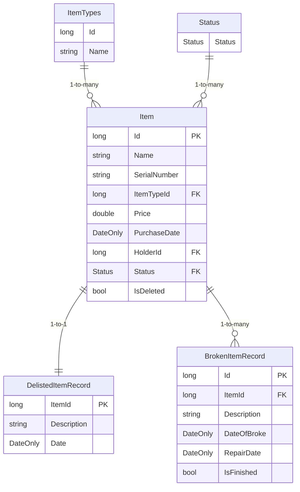

# inner-circle-items-api

## Migrations

### Adding a new migration  (Windows via Visual Studio)

Run the database using docker compose executing the following script
```bash
docker compose --profile db-only up -d
```

After making changes to the model and AppDbContext open Tools -> NuGet Package Manager -> Package Manager Console

Execute the following with your migration name
```bash
Add-Migration <YOUR_MIGRATION_NAME> -Project Application
```

To apply migration run the following:
```bash
Update-Database -Project Application
```


## Tests

### Running karate tests in dev-container

Run the docker compose with MockForPullRequest profile executing the following command

```bash
docker compose --profile MockForPullRequest up -d
```

Open VS Code for the `inner-circle-items-api` repo to use dev-container

Execute following command inside of the dev-container
```bash
java -jar /karate.jar .
```

## Database Schema

